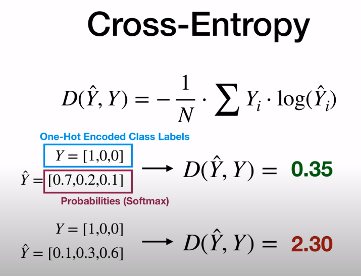
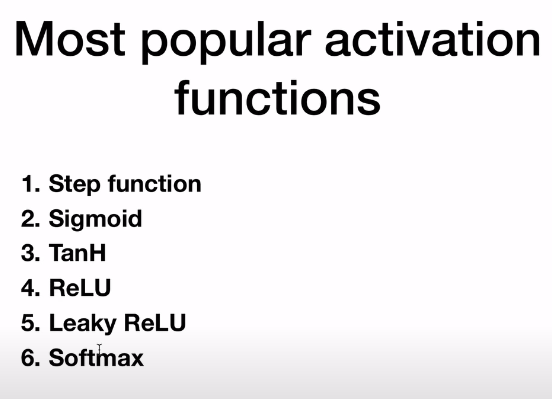

# PyTorch-Notes

Listing my PyTorch Notes. The source is [Deep Learning With PyTorch - Full Course](https://www.youtube.com/watch?v=c36lUUr864M)

1) Tensors are core data abstractions of PyTorch. Our inputs, outputs and weights are all tensors.

2) Autograd is pytorch's automatic differentation engine. The backward pass of our model is done with a single function call.

## Tensors

3) In numpy, there are vectors and arrays. However, everything in pytorch is a tensor. Tensor can be 1-dimensional, 2-dimensional, 3-dimensional or more.

4) To create an empty tensor in different dimensions

```run.py
x_scalar = torch.empty(1)
x_vector = torch.empty(3)
x_matrix = torch.empty(2,3)
x_more_dimensions = torch.empty(4,5,6)

print(x_scalar.shape,x_vector.shape,x_matrix.shape,x_more_dimensions.shape)
#torch.Size([1]) torch.Size([3]) torch.Size([2, 3]) torch.Size([4, 5, 6])
```

5) To use numpy alike zeros, ones and rand in torch, run the following. We can make operations like mathematical operations like (+, -, *, /) in element wise.

```numpy_alike.py
x_ones = torch.ones(3,4, dtype=torch.float16)
x_random = torch.rand(3,4,dtype=torch.double)

x_via_operator = x_ones + x_random
x_via_method = torch.add(x_ones,x_random)

x_zeros = torch.zeros(1,3,4)
```

6) To create a torch tensorf from a python list, x = torch.tensor([3,4,5])

7) In pytorch, every function that has a trailing underscore(\_) is making inplace operation. Examples are torch.add\_, torch.sub\_, torch.mul\_, torch.div\_.

8) We can use colon(:) in sciling operations as we did in numpy.

9) If there is only one value in our tensor, we can access it via **.item()**.

```item_example.py
x = torch.tensor([3,4,5])
print(x[0].item())# 3
```

10) To reshape a tensor, use view **torch.view()**

```reshape.py

x = torch.rand(8,8)
y = x.view(-1,16)
print(y.size())#torch.Size([4, 16])
z = x.view(32,2)
print(z.size())#torch.Size([32, 2])
```

11) If we want to convert a torch array to numpy array, use **.numpy()** function. If we are using pytorch on cpu and converting a pytorch tensorf to a numpy array, they are using  the same memory location. Thus, an update to a torch tensor will alter the numpy array or vice versa(an update to a numpy array will calter the torch tensor). A tensor moved to GPU can't be converted to numpy array.

```numpy_convert.py
import numpy as np
import torch

a = torch.rand(3,4)
a_numpy = a.numpy()
print(type(a), type(a_numpy))#<class 'torch.Tensor'> <class 'numpy.ndarray'>

b = np.ones(4)
b_torch = torch.from_numpy(b)
print(type(b), type(b_torch))


b = np.ones(4)
b_torch = torch.from_numpy(b)
print(type(b), type(b_torch))#<class 'numpy.ndarray'> <class 'torch.Tensor'>

```

12) To move a cpu tensor to GPU or vice versa, use `.to()` method of tensor.

```cuda_usage.py
if torch.cuda.is_available():
    device = torch.device("cuda")
    #first way to move a tensor to GPU
    x = torch.ones(4, device=device)
    # second way to move a tensor to GPU
    y = torch.rand(4)
    y = y.to(device=device)
    #z is a tensor on GPU
    z = x + y
    #can't convert torch gpu tensor to numpy, therefor convert it to cpu tensor first and then convert to numpy array
    z = z.to("cpu")
    z_numpy = z.numpy()
    print(type(z),type(z_numpy))#<class 'torch.Tensor'> <class 'numpy.ndarray'>

```

## Autograd

13) requires_grad is a parameter of tensor. It means the tensor is going to be optimized in training. In order for PyTorch to disable requires_grad parameter after creation, use the 2nd code snippet.

```run.py
a = torch.rand(100,100,requires_grad =True)
```

```disable.py
x = torch.randn(3,requires_grad=True)
#way 1
x.requires_grad_(False)
# way 2
x.detach()
# way 3
with torch.no_grad():
    y = x + 2
    # printing y and requires_grad is False
    print(y)
```

14) We can calculate gradients using autograd. In order to apply backward operation, the last elemnt should be scalar.

```autograd_usage.py
import numpy as np
import torch

a = torch.rand(3,requires_grad =True)
b = a + 2
c = b*b*4
d = c.mean()
print(d)
d.backward()#tensor(20.5779, grad_fn=<MeanBackward0>)
print(a.grad)#tensor([6.0689, 5.9862, 6.0895])

```

15) While looping in PyTorch, always set gradients of weights to 0.

```
weights = torch.ones(4,requires_grad=True)
for epoch in range(3):
    model_output = (weights*3).sum()
    model_output.backward()
    print(weights.grad)
    weights.grad.zero_()

```

## Backpropagation

16) 3 steps of backpropagation


```
import torch

x = torch.tensor(1.0)
y = torch.tensor(2.0)

w = torch.tensor(1.0,requires_grad=True)

#forward pass and compute the loss
y_hat = w * x
loss = (y_hat - y)**2

print(loss)
#backward loss
loss.backward()
print(w.grad)
#update weights
#next forward and backwards

```

## Gradient Descent

17) A numpy implementation of Linear Regression

```numpy_example.py
import numpy as np

X= np.array([1,2,3,4], dtype=np.float32)
Y= np.array([2,4,6,8], dtype=np.float32)

w = 0.0

# model prediction
def forward(x):
    return w*x

# loss = MSE
def loss(y, y_predicted):
    return ((y_predicted-y)**2).mean()

# gradient
# MSE = 1/N * (w*x -y)**2
# dJ/dw = 1/N * 2 * x * (w*x -y)

def gradient(x,y,y_predicted):
    return np.dot(2*x,y_predicted -y).mean()

print(f"Prediction before training: f(5) = {forward(5): .3f} ")

learning_rate = 0.01
n_iters = 10

for epoch in range(n_iters):
    # prediction = forward pass
    y_pred = forward(X)
    # loss
    l = loss(Y,y_pred)
    # gradients
    dw = gradient(X,Y,y_pred)
    # update weights
    w -= learning_rate * dw

    print(f"epoch {epoch}, w = {w}, loss = {l}")

print(f"Prediction after training f(5) = {forward(5)}")
```

18) Pytorch implementation of Lİnear Regression

```torch_implementation.py
import torch

X= torch.tensor([1,2,3,4], dtype=torch.float32)
Y= torch.tensor([2,4,6,8], dtype=torch.float32)

w = torch.tensor(0.0,dtype=torch.float32,requires_grad=True)

# model prediction
def forward(x):
    return w*x

# loss = MSE
def loss(y, y_predicted):
    return ((y_predicted-y)**2).mean()

# gradient
# MSE = 1/N * (w*x -y)**2
# dJ/dw = 1/N * 2 * x * (w*x -y)

print(f"Prediction before training: f(5) = {forward(5): .3f} ")

learning_rate = 0.01
n_iters = 100

for epoch in range(n_iters):
    # prediction = forward pass
    y_pred = forward(X)
    # loss
    l = loss(Y,y_pred)
    # gradients
    l.backward()
    
    # updateweights
    with torch.no_grad():
        w -= learning_rate * w.grad

    # setting gradients zero
    w.grad.zero_()

    print(f"epoch {epoch}, w = {w}, loss = {l}")

print(f"Prediction after training f(5) = {forward(5)}")

```

## Training Pipeline

19) General training pipeline in PyTorch is composed of 3 steps.

    1) Design model(input, output, forward pass)
    2) Construct loss and optimizer
    3) Training loop
        - Forward pass: Compute Prediction
        - Backward pass: gradients
        - update weights

20) An example pytorch training pipeline

```training_pipeline.py
import torch
import torch.nn as nn

X  = torch.tensor([[1],[2],[3],[4]], dtype=torch.float32)
Y  = torch.tensor([[2],[4],[6],[8]], dtype=torch.float32)

X_test = torch.tensor([5], dtype=torch.float32)

n_samples, n_features = X.shape

input_size = n_features
output_size = n_features


class LinearRegression(nn.Module):
    def __init__(self, input_dim, output_dim) -> None:
        super().__init__()
        self.lin = nn.Linear(input_dim, output_dim)

    def forward(self, x):
        return self.lin(x)

model = LinearRegression(input_dim=input_size, output_dim= output_size)


print(f"Prediction before training: f(5) = {model(X_test).item(): .3f} ")

learning_rate = 0.01
n_iters = 100

loss = nn.MSELoss()
optimizer = torch.optim.SGD(model.parameters(), lr = learning_rate)

for epoch in range(n_iters):
    # prediction = forward pass
    y_pred = model(X)
    # loss
    l = loss(Y,y_pred)
    # gradients
    l.backward()
    
    # updating weights
    optimizer.step()

    # setting gradients to zero
    optimizer.zero_grad()

    [w,b] = model.parameters()

    print(f"epoch {epoch}, w = {w[0][0].item()}, loss = {l}")

print(f"Prediction after training f(5) = {model(X_test).item(): .3f} ")

```

# Linear Regression

21) A linear regression implementation

```linear_reg.py

import matplotlib.pyplot as plt
import numpy as np
import torch
import torch.nn as nn
from sklearn import datasets

# Step0: Prepare data
X_numpy, y_numpy = datasets.make_regression(n_samples = 100, n_features = 1, noise = 20, random_state = 1)
X = torch.from_numpy(X_numpy.astype(np.float32))
y = torch.from_numpy(y_numpy.astype(np.float32))
y = y.view(y.shape[0],1)

n_samples, n_features = X.shape

#1) Step1: Model
input_size = n_features
output_size = 1
model = nn.Linear(input_size,output_size)

# 2) Loss and optimizer
learning_rate = 0.001
criterion = nn.MSELoss()
optimizer = torch.optim.SGD(model.parameters(), lr= learning_rate)

# 3) Training Loop

num_epochs = 100
for epoch in range(num_epochs):
    # forward pass and loss
    y_predicted = model(X)
    loss = criterion(y_predicted,y)

    #backward pass(back propogation and calculates gradients for us)
    loss.backward()

    # update(updating model weights)
    optimizer.step()

    # set gradients to 0
    optimizer.zero_grad()

    print(f"epoch: { epoch + 1}, loss = {loss.item()}")

# plot
# detach will create a new tensor, where our gradient calculation attribute is set to False
predicted = model(X).detach().numpy()
plt.plot(X_numpy, y_numpy, 'ro')
plt.plot(X_numpy, predicted,'b')
plt.show()

```

## Logistic Regression

22) Logistic regression implementation

```logistic.py
import numpy as np
import torch
import torch.nn as nn
from sklearn import datasets
from sklearn.model_selection import train_test_split
from sklearn.preprocessing import StandardScaler

# Step0: Prepare data
bc = datasets.load_breast_cancer()

X, y = bc.data, bc.target


n_samples, n_features = X.shape

X_train, X_test, y_train, y_test = train_test_split(X, y, test_size= 0.2, random_state= 51)

# scale
sc = StandardScaler()
X_train = sc.fit_transform(X_train)
X_test = sc.transform(X_test)

X_train = torch.from_numpy(X_train.astype(np.float32))
X_test = torch.from_numpy(X_test.astype(np.float32))
y_train = torch.from_numpy(y_train.astype(np.float32))
y_test = torch.from_numpy(y_test.astype(np.float32))

y_train = y_train.view(y_train.shape[0], 1)
y_test = y_test.view(y_test.shape[0], 1)

#1) Step1: Model

class LogisticRegression(nn.Module):
    def __init__(self, n_input_features) -> None:
        super().__init__()
        self.linear = nn.Linear(n_input_features,1)
    
    def forward(self, x):
        y_predicted = torch.sigmoid(self.linear(x))
        return y_predicted

model = LogisticRegression(n_input_features=n_features)

# 2) Loss and optimizer
learning_rate = 0.01
criterion = nn.BCELoss()
optimizer = torch.optim.SGD(model.parameters(), lr= learning_rate)

# 3) Training Loop

num_epochs = 100
for epoch in range(num_epochs):
    # forward pass and loss
    y_predicted = model(X_train)
    loss = criterion(y_predicted,y_train)

    #backward pass(back propogation and calculates gradients for us)
    loss.backward()

    # update(updating model weights)
    optimizer.step()

    # set gradients to 0
    optimizer.zero_grad()

    print(f"epoch: { epoch + 1}, loss = {loss.item()}")

with torch.no_grad():
    y_predicted = model(X_test)
    y_predicted_cls = y_predicted.round()
    acc = y_predicted_cls.eq(y_test).sum() / float(y_test.shape[0])
    print(f"accuracy = {acc:.4f}")

```

## Dataset and DataLoader

23) If we use Dataset and DataLoader from pytorch, it will automatically deal with batch looping.

```dataset_dataloader.py
import math

import numpy as np
import torch
import torchvision
from torch.utils.data import DataLoader, Dataset


class WineDataset(Dataset):

    def __init__(self) -> None:
        # data loading
        xy = np.loadtxt('./data/wine/wine.csv',delimiter = ',', dtype = np.float32, skiprows = 1)
        self.x = torch.from_numpy(xy[:,1:])
        self.y = torch.from_numpy(xy[:,[0]])# n_samples, 1
        self.n_samples = xy.shape[0]
    
    def __getitem__(self, index):
        return self.x[index], self.y[index]

    def __len__(self):
        return self.n_samples

dataset = WineDataset()
dataloader = DataLoader(dataset=dataset, batch_size= 4, shuffle=True, num_workers=2)
# training loop
num_epochs = 2
total_samples = len(dataset)
n_iterations =  (total_samples/ 4)
print(total_samples, n_iterations)

for epoch in range(num_epochs):
    for i, (inputs,labels) in enumerate(dataloader):
        print(f"epoch: {epoch+1}/{num_epochs}, step {i + 1}/ {n_iterations}, inputs {inputs.shape}")
    
# built-in Pytorch dataset, cifar, coco, MNIST
# torchvision.datasets.MNIST()
```

## Dataset Transforms

24) Transform options are listed [here](https://pytorch.org/vision/stable/transforms.html). `torchvision.transforms.ToTensor()` is used a lot.

```transform_example.py
import numpy as np
import torch
import torchvision
from torch.utils.data import Dataset


class WineDataset(Dataset):

    def __init__(self, transform = None) -> None:
        # data loading
        xy = np.loadtxt('./data/wine/wine.csv',delimiter = ',', dtype = np.float32, skiprows = 1)
        self.x = xy[:,1:]
        self.y = xy[:,[0]]# n_samples, 1
        self.n_samples = xy.shape[0]

        self.transform = transform
    
    def __getitem__(self, index):
        x_sample, y_sample = self.x[index], self.y[index]
        if self.transform:
            x_sample = self.transform(x_sample)
        return x_sample, y_sample

    def __len__(self):
        return self.n_samples

class ToTensor:
    def __call__(self, sample):
        inputs, targets = sample
        return torch.from_numpy(inputs), torch.from_numpy(targets)

class MulTransform:
    def __init__(self,factor) -> None:
        self.factor = factor
    
    def __call__(self, sample):
        inputs,target = sample
        inputs *= self.factor
        return inputs, target

dataset = WineDataset(transform=None)
dataset = WineDataset(transform=ToTensor())

composed = torchvision.transforms.Compose(
    [ToTensor(),MulTransform(2)]
)
dataset = WineDataset(transform=composed)

```

## Softmax and CrossEntropy

25) A basic usage of `torch.softmax`

```
x = torch.tensor([2,1,0.1])
x_logit = torch.softmax(x, dim=0)
print(x_logit)#tensor([0.6590, 0.2424, 0.0986])
```

26) Softmax function is usually combined with cross entropy loss.



27) nn.CrossEntropyLoss applies nn.LogSoftmax + nn.NLLLoss(negative log likelihood loss). **Don't put softmax in last layer**.
**The target(y) has class labels and it isn't one-hot encoded**. Y_pred has raw scores(logits), therefore softmax should't be implemented explicitly.

```loss.py
import torch
import torch.nn as nn

loss = nn.CrossEntropyLoss()

y = torch.tensor([0])
#nsamples x nclasses = 1x3
y_pred_good = torch.tensor([[2.0, 1.0, 0.1]])
y_pred_bad = torch.tensor([[0.1, 3.0, 0.5]])

l1 = loss(y_pred_good,y)
l2 = loss(y_pred_bad,y)
print(l1.item())#0.4170
print(l2.item())#3.0284

_, predictions1 = torch.max(y_pred_good,1)
_, predictions2 = torch.max(y_pred_bad,1)
print(predictions1)#tensor([0])
print(predictions2)#tensor([1])

y_multiple = torch.tensor([0,1,2,2,1])
y_pred_multiple = torch.tensor([
    [0.6,0.2,0.33],
    [0.4,0.1,0.1],
    [0.5,0.9,0.8],
    [0.1,1.99,3.4],
    [0.2,0.22,2.1]
])
l_multiple = loss(y_pred_multiple,y_multiple)
print(l_multiple)#tensor(1.1072)
```

28) An example NeuralNet for Multiclass classification

```neuralnet.py
import torch
import torch.nn as nn


class NeuralNetMulticlass(nn.Module):
    def __init__(self,input_size, hidden_size, num_classses) -> None:
        super().__init__()
        self.linear1 = nn.Linear(input_size,hidden_size)
        self.relu = nn.ReLU()
        self.linear2= nn.Linear(hidden_size,num_classses)
    
    def forward(self, x):
        out = self.linear1(x)
        out = self.relu(out)
        out = self.linear2(out)
        #no softmax at the end
        return out

model = NeuralNetMulticlass(input_size=28*28, hidden_size=5, num_classses=3)
criterion = nn.CrossEntropyLoss()
```

29) Binary Classification example. EXPLICITLY define torch.sigmoid in forward method.

```binary.py
import torch
import torch.nn as nn


class NeuralNetBinary(nn.Module):
    def __init__(self,input_size, hidden_size) -> None:
        super().__init__()
        self.linear1 = nn.Linear(input_size,hidden_size)
        self.relu = nn.ReLU()
        self.linear2= nn.Linear(hidden_size,1)
    
    def forward(self, x):
        out = self.linear1(x)
        out = self.relu(out)
        out = self.linear2(out)
        # sigmoid at the end
        y_pred = torch.sigmoid(out)
        return y_pred

model = NeuralNetBinary(input_size=28*28, hidden_size=5)
criterion = nn.BCELoss()
```

## Activation Function

30) Without activation function, Neural Networks are stacked linear regression models built on top of each other.



```activation_usage.py

import torch
import torch.nn as nn
import torch.nn.functional as F


class ActivationFunction(nn.Module):
    def __init__(self,input_size, hidden_size) -> None:
        super().__init__()
        self.linear1 = nn.Linear(input_size,hidden_size)
        self.relu = nn.ReLU()
        self.tanh = nn.Tanh()
        self.leaky_relu = nn.LeakyReLU()
        self.softmax = nn.Softmax()
        self.linear2= nn.Linear(hidden_size,1)
    
    def forward(self, x):
        out = self.linear1(x)
        out = self.relu(out)
        out = self.linear1(x)
        out = self.tanh(out)
        out = self.linear2(out)
        # sigmoid at the end
        y_pred = F.sigmoid(out)
        return y_pred

model = ActivationFunction(input_size=28*28, hidden_size=5)
criterion = nn.BCELoss()
```

## Feed Forward Neural Network

31) The model and input data should be on the same device. If it differs, the code fails.

32) An example Feed forward neural network

```ffnn.py
import matplotlib.pyplot as plt
import torch
import torch.nn as nn
import torchvision
import torchvision.transforms as transforms

# device config
device = torch.device('cuda' if torch.cuda.is_available() else 'cpu' )
print(device)
# hyperparameters
input_size = 784# 28 * 28
hidden_size = 100
num_classes = 10
num_epochs = 30
batch_size = 100
learning_rate = 1e-3

# MNIST
train_dataset = torchvision.datasets.MNIST(root='./data',train=True, transform=transforms.ToTensor(), download=True)

test_dataset = torchvision.datasets.MNIST(root='./data',train=False, transform=transforms.ToTensor())

train_loader = torch.utils.data.DataLoader(dataset = train_dataset, batch_size = batch_size, shuffle = True)
test_loader = torch.utils.data.DataLoader(dataset = test_dataset, batch_size = batch_size, shuffle = False)

examples = iter(train_loader)
samples, labels = next(examples)
print(samples.shape, labels.shape)#torch.Size([100, 1, 28, 28]) torch.Size([100])

for i in range(6):
    
    plt.subplot(2,3,i+1)
    plt.imshow(samples[i][0],cmap = 'gray')
# plt.show()

class NeuralNet(nn.Module):
    def __init__(self, input_size, hidden_size, num_classes) -> None:
        super().__init__()
        self.l1 = nn.Linear(input_size,hidden_size)
        self.relu = nn.ReLU()
        self.l2 = nn.Linear(hidden_size,num_classes)

    def forward(self, x):
        out = self.l1(x)
        out = self.relu(out)
        out = self.l2(out)
        return out
        
model = NeuralNet(input_size=input_size,hidden_size=hidden_size,num_classes=num_classes).to(device)

criterion = nn.CrossEntropyLoss()
optimizer = torch.optim.Adam(model.parameters(),lr = learning_rate)

# training loop
n_total_steps = len(train_loader)
for epoch in range(num_epochs):
    for i, (images, labels) in enumerate(train_loader):
        # reshaping 100,1,28,28 -> 100, 784
        images = images.reshape(-1,28*28).to(device)
        labels = labels.to(device)

        # forward
        outputs = model(images)
        loss = criterion(outputs, labels)
        # set gradients to 0 first
        optimizer.zero_grad()
        # back propogate gradients
        loss.backward()
        # update weights via learning rate and gradients
        optimizer.step()

        if (i + 1) % 100 == 0:
            print(f"epoch / {epoch + 1}, step {i + 1} / {n_total_steps}, loss = {loss.item()}")

# testing
with torch.no_grad():
    n_correct = 0
    n_samples = 0
    for images, labels in test_loader:
        images = images.reshape(-1,28*28).to(device)
        labels = labels.to(device)
        outputs = model(images)

        # value, index
        _, predictions = torch.max(outputs, 1)
        
        n_samples += labels.shape[0]
        n_correct += (predictions == labels).sum().item()

    acc = 100.0 * n_correct / n_samples
    print(f"accuracy = {acc}")
```

## Convolutional Neural Network - CNN

33) An example Convolutional Neural Network

```convnet.py

import matplotlib.pyplot as plt
import torch
import torch.nn as nn
import torch.nn.functional as F
import torchvision
import torchvision.transforms as transforms

# device config
device = torch.device('cuda' if torch.cuda.is_available() else 'cpu' )
print(device)
# hyperparameters
input_size = 784# 28 * 28
hidden_size = 100
num_classes = 10
num_epochs = 1
batch_size = 4
learning_rate = 1e-3

# dataset has pilimage images of range [0,1]
# we transform them to tensors of normalized range [-1,1]

transform = transforms.Compose(transforms=[
    transforms.ToTensor(),
    transforms.Normalize((0.5,0.5,0.5), (0.5,0.5,0.5))
])


# CIFAR10
train_dataset = torchvision.datasets.CIFAR10(root='./data',train=True, transform=transform, download=True)

test_dataset = torchvision.datasets.CIFAR10(root='./data',train=False, download=True, transform=transform)

train_loader = torch.utils.data.DataLoader(dataset = train_dataset, batch_size = batch_size, shuffle = True)
test_loader = torch.utils.data.DataLoader(dataset = test_dataset, batch_size = batch_size, shuffle = False)

classes = ('place','car','bird','cat','deer','dog','frog','horse','ship','truck')


class ConvNet(nn.Module):
    def __init__(self) -> None:
        #in_channels=3 because the image is RGB.
        super(ConvNet,self).__init__()
        self.conv1 = nn.Conv2d(in_channels=3, out_channels=6, kernel_size=5)
        self.pool = nn.MaxPool2d(kernel_size=2, stride=2)
        # in_channels is 6 in self.conv2 because it is out_channels of self.conv1
        self.conv2 = nn.Conv2d(in_channels=6, out_channels=16, kernel_size=5)
        self.fc1 = nn.Linear(in_features= 16*5*5, out_features=120)
        self.fc2 = nn.Linear(in_features=120,out_features=84)
        self.fc3 = nn.Linear(in_features= 84, out_features= 10)


    def forward(self, x):
        x = self.pool(F.relu(self.conv1(x)))
        x = self.pool(F.relu(self.conv2(x)))
        # Flattening
        x = x.view(-1, 16*5*5)
        x = F.relu(self.fc1(x))
        x = F.relu(self.fc2(x))
        x = self.fc3(x)
        return x

        
model = ConvNet().to(device)

criterion = nn.CrossEntropyLoss()
optimizer = torch.optim.Adam(model.parameters(),lr = learning_rate)

# training loop
n_total_steps = len(train_loader)
for epoch in range(num_epochs):
    for i, (images, labels) in enumerate(train_loader):
        # reshaping 100,1,28,28 -> 100, 784
        images = images.to(device)
        labels = labels.to(device)

        # forward
        outputs = model(images)
        loss = criterion(outputs, labels)
        # set gradients to 0 first
        optimizer.zero_grad()
        # back propogate gradients
        loss.backward()
        # update weights via learning rate and gradients
        optimizer.step()

        if (i + 1) % 100 == 0:
            print(f"epoch / {epoch + 1}, step {i + 1} / {n_total_steps}, loss = {loss.item()}")

# testing
with torch.no_grad():
    n_correct = 0
    n_samples = 0
    n_class_correct = [0 for i in range(10)]
    n_class_samples = [0 for i in range(10)]
    for images, labels in test_loader:
        images = images.to(device)
        labels = labels.to(device)
        outputs = model(images)

        # value, index
        _, predicted = torch.max(outputs, 1)
        
        n_samples += labels.size(0)
        n_correct += (predicted == labels).sum().item()

        for i in range(batch_size):
            label = labels[i]
            pred = predicted[i]
            if (label == pred):
                n_class_correct[label] +=1
            n_class_samples[label] +=1

    acc = 100.0 * n_correct / n_samples
    print(f"accuracy of the newwork = {acc}")
    
    for i in range(10):
        acc = 100.0 * n_class_correct[i] / n_class_samples[i]
        print(f"Accuracy of {classes[i]}: {acc} %")
```

## Transfer Learning

34) Transfer Learning without freezing all layers

```without_all_freeze.py
#pretrained model, discarding last layer and setting up a new layer
# train all layers without freezing
model = models.resnet18(pretrained = True)
in_features = model.fc.in_features
model.fc = nn.Linear(in_features=in_features,out_features=2)
model.to(device=device)

criterion = nn.CrossEntropyLoss()
optimizer = optim.SGD(model.parameters(), lr = 1e-3)

# scheduler
# it will update learning rate
step_lr_scheduler = lr_scheduler.StepLR(optimizer, step_size=7, gamma=0.1)

model = train_model(model, criterion, optimizer, step_lr_scheduler, num_epochs=25)
```

35) Transfer Learning with freezing most layers

```
#pretrained model, discarding last layer and setting up a new layer
# train all layers without freezing
model = models.resnet18(pretrained = True)
for param in model.parameters():
    param.requires_grad = False
in_features = model.fc.in_features
# be default, the below layer has requires_grad is True.
model.fc = nn.Linear(in_features=in_features,out_features=2)
model.to(device=device)

criterion = nn.CrossEntropyLoss()
optimizer = optim.SGD(model.parameters(), lr = 1e-3)

# scheduler
# it will update learning rate
step_lr_scheduler = lr_scheduler.StepLR(optimizer, step_size=7, gamma=0.1)

model = train_model(model, criterion, optimizer, step_lr_scheduler, num_epochs=25)
```

## Tensorbard

36) To start a tensorboard client on terminal on [localhost:6006](http://localhost:6006/). Take a look at [Tensorboard on PyTorch](https://pytorch.org/docs/stable/tensorboard.html) link.

```tersorboard.sh
tensorboard --logdir=runs
```

37) Tensorboard usage for add_image, add_graph, add_scalar, add_pr_curve.

```tesorboard_usage.py
import sys

import matplotlib.pyplot as plt
import torch
import torch.nn as nn
import torch.nn.functional as F
import torchvision
import torchvision.transforms as transforms
#tensorboard things:
from torch.utils.tensorboard import SummaryWriter

writer = SummaryWriter("runs/mnist")

# device config
device = torch.device('cuda' if torch.cuda.is_available() else 'cpu' )
print(device)
# hyperparameters
input_size = 784# 28 * 28
hidden_size = 100
num_classes = 10
num_epochs = 5
batch_size = 100
learning_rate = 1e-3

# MNIST
train_dataset = torchvision.datasets.MNIST(root='./data',train=True, transform=transforms.ToTensor(), download=True)

test_dataset = torchvision.datasets.MNIST(root='./data',train=False, transform=transforms.ToTensor())

train_loader = torch.utils.data.DataLoader(dataset = train_dataset, batch_size = batch_size, shuffle = True)
test_loader = torch.utils.data.DataLoader(dataset = test_dataset, batch_size = batch_size, shuffle = False)

examples = iter(train_loader)
samples, labels = next(examples)
print(samples.shape, labels.shape)#torch.Size([100, 1, 28, 28]) torch.Size([100])

for i in range(6):
    
    plt.subplot(2,3,i+1)
    plt.imshow(samples[i][0],cmap = 'gray')
# plt.show()
# tensorboard things
img_grid = torchvision.utils.make_grid(samples)
writer.add_image('mnist_images',img_grid)
#sys.exit()

class NeuralNet(nn.Module):
    def __init__(self, input_size, hidden_size, num_classes) -> None:
        super().__init__()
        self.l1 = nn.Linear(input_size,hidden_size)
        self.relu = nn.ReLU()
        self.l2 = nn.Linear(hidden_size,num_classes)

    def forward(self, x):
        out = self.l1(x)
        out = self.relu(out)
        out = self.l2(out)
        return out
        
model = NeuralNet(input_size=input_size,hidden_size=hidden_size,num_classes=num_classes).to(device)

criterion = nn.CrossEntropyLoss()
optimizer = torch.optim.Adam(model.parameters(),lr = learning_rate)

# tensorbaoard things :model architecture
writer.add_graph(model,samples.reshape(-1,28*28).to(device))
running_loss = 0.0
running_correct = 0.0

# training loop
n_total_steps = len(train_loader)
for epoch in range(num_epochs):
    for i, (images, labels) in enumerate(train_loader):
        # reshaping 100,1,28,28 -> 100, 784
        images = images.reshape(-1,28*28).to(device)
        labels = labels.to(device)

        # forward
        outputs = model(images)
        loss = criterion(outputs, labels)
        # set gradients to 0 first
        optimizer.zero_grad()
        # back propogate gradients
        loss.backward()
        # update weights via learning rate and gradients
        optimizer.step()

        # tensorbaoard things :eval metrics
        running_loss += loss.item()
        _, predicted = torch.max(outputs.data,1)
        running_correct += (predicted ==labels).sum().item()

        if (i + 1) % 100 == 0:
            print(f"epoch / {epoch + 1}, step {i + 1} / {n_total_steps}, loss = {loss.item()}")
            #tensorbaoard things:
            writer.add_scalar('training loss',running_loss / 100, epoch*n_total_steps + 1)
            writer.add_scalar('accuracy',running_correct / 100, epoch*n_total_steps + 1)
            running_loss = 0.0
            running_correct = 0.0
# testing
preds = []
labels_list = []
with torch.no_grad():
    n_correct = 0
    n_samples = 0
    for images, labels in test_loader:
        images = images.reshape(-1,28*28).to(device)
        labels = labels.to(device)
        outputs = model(images)

        # value, index
        _, predicted = torch.max(outputs, 1)
        
        n_samples += labels.shape[0]
        n_correct += (predicted == labels).sum().item()

        class_predictions = [F.softmax(output, dim = 0) for output in outputs]
        preds.append(class_predictions)
        labels_list.append(predicted)

    preds = torch.cat([torch.stack(batch) for batch in preds])
    labels_list = torch.cat(labels_list)

    acc = 100.0 * n_correct / n_samples
    print(f"accuracy = {acc}")

    classes = range(10)
    for i in classes:
        labels_i = labels_list == i
        preds_i = preds[:,i]
        writer.add_pr_curve(str(i), labels_i, preds_i, global_step=0)
        writer.close()

```

## Saving and Loading

38) Lazy method to save and load torch objects

```lazy.py
import torch
import torch.nn as nn


class Model(nn.Module):
    def __init__(self,n_input_features) -> None:
        super().__init__()
        self.linear = nn.Linear(n_input_features,1)
    def forward(self, x):
        y_pred = torch.sigmoid(self.linear(x))
        return y_pred

model = Model(n_input_features=6)

# lazy method
## saving
FILE = "model.pth"
torch.save(model,FILE)

## loading
FILE = "model.pth"
model_loaded = torch.load(FILE)
model_loaded.eval()
for param in model_loaded.parameters():
    print(param)
#Parameter containing:
#tensor([[-0.0711,  0.2330, -0.0707, -0.3024, -0.1600,  0.3227]],
#       requires_grad=True)
#Parameter containing:
#tensor([-0.0933], requires_grad=True)
```

39) Recommended way to save and load objects

```recommended.py
import torch
import torch.nn as nn


class Model(nn.Module):
    def __init__(self,n_input_features) -> None:
        super().__init__()
        self.linear = nn.Linear(n_input_features,1)
    def forward(self, x):
        y_pred = torch.sigmoid(self.linear(x))
        return y_pred

model = Model(n_input_features=6)

for param in model.parameters():
    print(param)

#Parameter containing:
#tensor([[-0.2456,  0.1838, -0.3748, -0.3253, -0.3439,  0.0043]],
#       requires_grad=True)
#Parameter containing:
#tensor([0.3711], requires_grad=True)

## dumping
FILE = "model.pth"
torch.save(model.state_dict(),FILE)

## loading
FILE = "model.pth"
loaded_model = Model(n_input_features=6)
loaded_model.load_state_dict(torch.load(FILE))
loaded_model.eval()

for param in loaded_model.parameters():
    print(param)

## printing the same weights
#Parameter containing:
#tensor([[-0.2456,  0.1838, -0.3748, -0.3253, -0.3439,  0.0043]],
#       requires_grad=True)
#Parameter containing:
#tensor([0.3711], requires_grad=True)
```

40) While dumping a model, use a file name ending with **.pth**.

41) Checkpoint usage

```checkpoint_usage.py
import torch
import torch.nn as nn


class Model(nn.Module):
    def __init__(self,n_input_features) -> None:
        super().__init__()
        self.linear = nn.Linear(n_input_features,1)
    def forward(self, x):
        y_pred = torch.sigmoid(self.linear(x))
        return y_pred

model = Model(n_input_features=6)

learning_rate = 0.01
optimizer = torch.optim.SGD(model.parameters(), lr=learning_rate)
print(optimizer.state_dict())

# saving a checkpoint
checkpoint = {
    "epoch": 90,
    "model_state": model.state_dict(),
    "optim_state": optimizer.state_dict()
}

torch.save(checkpoint, "checkpoint.pth")

loaded_checkpoint = torch.load("checkpoint.pth")
epoch = loaded_checkpoint['epoch']
new_model = Model(n_input_features=6)
new_optimizer = torch.optim.SGD(new_model.parameters(),lr = 0)

new_model.load_state_dict(checkpoint['model_state'])
new_optimizer.load_state_dict(checkpoint['optim_state'])

print(new_optimizer.state_dict())#printing the same results before loading

```

## Other notes

42) If we trained our model on gpu and use it on cpu or vice versa, take a look at torch.load(map_location = device); `device` is either torch.device('cuda') or torch.device('cpu').

43) If we want to evaluate our models via `with torch.no_grad():` context manager, we should first run model.eval() first because of the fact that some layers like dropout and batch normalization may behave different during the phases training and evaluation. In addition to this, don't forget to run `model.train()` before training.

```
model.eval()

with torch.no_grad():
    #perform evaluation

```

44) In order to transform data via `transforms.Compose(transforms=[ transforms.ToTensor(),transforms.Normalize((0.5,0.5,0.5), (0.5,0.5,0.5))])`, our image input before transform operation should be an RGB pillow image(for the current case).

45) The below code can be used to read an image in \__getitem__ method.

```run.py
from torchvision.io import read_image

class CustomDataset():
    def __init__(self):
        pass
    def __getitem__(self):
        image = read_image(img_path)

```

46) To concatenate a list of pytorch tensors

```
import torch
mylist = [torch.randn(2, 3),torch.randn(2, 3),torch.randn(2, 3),torch.randn(2, 3)]
concatted = torch.cat(mylist, 0)
print(concatted.shape)#(8,3)
```
