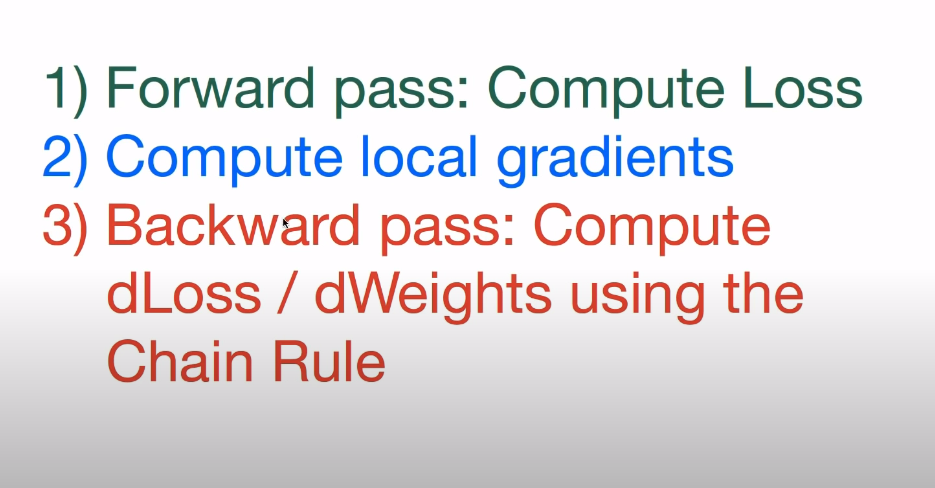
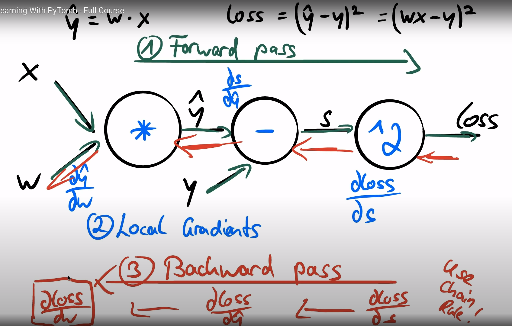
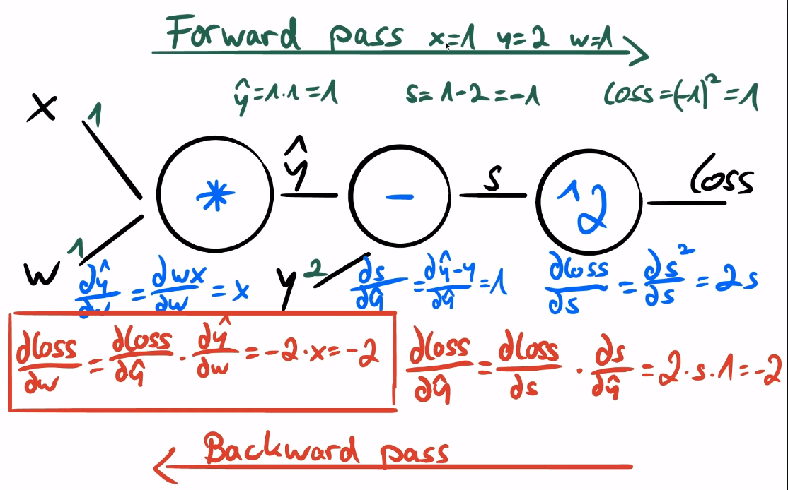

# PyTorch-Notes
Listing my PyTorch Notes

1) Tensors are core data abstractions of PyTorch. Our inputs, outputs and weights are all tensors.

2) Autograd is pytorch's automatic differentation engine. The backward pass of our model is done with a single function call.

## Tensors

3) In numpy, there are vectors and arrays. However, everything in pytorch is a tensor. Tensor can be 1-dimensional, 2-dimensional, 3-dimensional or more.

4) To create an empty tensor in different dimensions

```run.py
x_scalar = torch.empty(1)
x_vector = torch.empty(3)
x_matrix = torch.empty(2,3)
x_more_dimensions = torch.empty(4,5,6)

print(x_scalar.shape,x_vector.shape,x_matrix.shape,x_more_dimensions.shape)
#torch.Size([1]) torch.Size([3]) torch.Size([2, 3]) torch.Size([4, 5, 6])
```

5) To use numpy alike zeros, ones and rand in torch, run the following. We can make operations like mathematical operations like (+, -, *, /) in element wise.

```numpy_alike.py
x_ones = torch.ones(3,4, dtype=torch.float16)
x_random = torch.rand(3,4,dtype=torch.double)

x_via_operator = x_ones + x_random
x_via_method = torch.add(x_ones,x_random)

x_zeros = torch.zeros(1,3,4)
```

6) To create a torch tensorf from a python list, x = torch.tensor([3,4,5])

7) In pytorch, every function that has a trailing underscore(\_) is making inplace operation. Examples are torch.add\_, torch.sub\_, torch.mul\_, torch.div\_.

8) We can use colon(:) in sciling operations as we did in numpy.

9) If there is only one value in our tensor, we can access it via **.item()**.

```item_example.py
x = torch.tensor([3,4,5])
print(x[0].item())# 3
```

10) To reshape a tensor, use view **torch.view()**

```reshape.py

x = torch.rand(8,8)
y = x.view(-1,16)
print(y.size())#torch.Size([4, 16])
z = x.view(32,2)
print(z.size())#torch.Size([32, 2])
```

11) If we want to convert a torch array to numpy array, use **.numpy()** function. If we are using pytorch on cpu and converting a pytorch tensorf to a numpy array, they are using  the same memory location. Thus, an update to a torch tensor will alter the numpy array or vice versa(an update to a numpy array will calter the torch tensor). A tensor moved to GPU can't be converted to numpy array.

```numpy_convert.py
import numpy as np
import torch

a = torch.rand(3,4)
a_numpy = a.numpy()
print(type(a), type(a_numpy))#<class 'torch.Tensor'> <class 'numpy.ndarray'>

b = np.ones(4)
b_torch = torch.from_numpy(b)
print(type(b), type(b_torch))


b = np.ones(4)
b_torch = torch.from_numpy(b)
print(type(b), type(b_torch))#<class 'numpy.ndarray'> <class 'torch.Tensor'>

```

12) To move a cpu tensor to GPU or vice versa, use `.to()` method of tensor.

```cuda_usage.py
if torch.cuda.is_available():
    device = torch.device("cuda")
    #first way to move a tensor to GPU
    x = torch.ones(4, device=device)
    # second way to move a tensor to GPU
    y = torch.rand(4)
    y = y.to(device=device)
    #z is a tensor on GPU
    z = x + y
    #can't convert torch gpu tensor to numpy, therefor convert it to cpu tensor first and then convert to numpy array
    z = z.to("cpu")
    z_numpy = z.numpy()
    print(type(z),type(z_numpy))#<class 'torch.Tensor'> <class 'numpy.ndarray'>

```

## Autograd

13) requires_grad is a parameter of tensor. It means the tensor is going to be optimized in training. In order for PyTorch to disable requires_grad parameter after creation, use the 2nd code snippet.

```run.py
a = torch.rand(100,100,requires_grad =True)
```

```disable.py
x = torch.randn(3,requires_grad=True)
#way 1
x.requires_grad_(False)
# way 2
x.detach()
# way 3
with torch.no_grad():
    y = x + 2
    # printing y and requires_grad is False
    print(y)
```

14) We can calculate gradients using autograd. In order to apply backward operation, the last elemnt should be scalar.

```autograd_usage.py
import numpy as np
import torch

a = torch.rand(3,requires_grad =True)
b = a + 2
c = b*b*4
d = c.mean()
print(d)
d.backward()#tensor(20.5779, grad_fn=<MeanBackward0>)
print(a.grad)#tensor([6.0689, 5.9862, 6.0895])

```

15) While looping in PyTorch, always set gradients of weights to 0.

```
weights = torch.ones(4,requires_grad=True)
for epoch in range(3):
    model_output = (weights*3).sum()
    model_output.backward()
    print(weights.grad)
    weights.grad.zero_()

```

## Backpropagation

16) 3 steps of backpropagation







```
import torch

x = torch.tensor(1.0)
y = torch.tensor(2.0)

w = torch.tensor(1.0,requires_grad=True)

#forward pass and compute the loss
y_hat = w * x
loss = (y_hat - y)**2

print(loss)
#backward loss
loss.backward()
print(w.grad)
#update weights
#next forward and backwards

```

## Gradient Descent

17) A numpy implementation of Linear Regression

```numpy_example.py
import numpy as np

X= np.array([1,2,3,4], dtype=np.float32)
Y= np.array([2,4,6,8], dtype=np.float32)

w = 0.0

# model prediction
def forward(x):
    return w*x

# loss = MSE
def loss(y, y_predicted):
    return ((y_predicted-y)**2).mean()

# gradient
# MSE = 1/N * (w*x -y)**2
# dJ/dw = 1/N * 2 * x * (w*x -y)

def gradient(x,y,y_predicted):
    return np.dot(2*x,y_predicted -y).mean()

print(f"Prediction before training: f(5) = {forward(5): .3f} ")

learning_rate = 0.01
n_iters = 10

for epoch in range(n_iters):
    # prediction = forward pass
    y_pred = forward(X)
    # loss
    l = loss(Y,y_pred)
    # gradients
    dw = gradient(X,Y,y_pred)
    # update weights
    w -= learning_rate * dw

    print(f"epoch {epoch}, w = {w}, loss = {l}")

print(f"Prediction after training f(5) = {forward(5)}")
```

18) Pytorch implementation of Lİnear Regression

```torch_implementation.py
import torch

X= torch.tensor([1,2,3,4], dtype=torch.float32)
Y= torch.tensor([2,4,6,8], dtype=torch.float32)

w = torch.tensor(0.0,dtype=torch.float32,requires_grad=True)

# model prediction
def forward(x):
    return w*x

# loss = MSE
def loss(y, y_predicted):
    return ((y_predicted-y)**2).mean()

# gradient
# MSE = 1/N * (w*x -y)**2
# dJ/dw = 1/N * 2 * x * (w*x -y)

print(f"Prediction before training: f(5) = {forward(5): .3f} ")

learning_rate = 0.01
n_iters = 100

for epoch in range(n_iters):
    # prediction = forward pass
    y_pred = forward(X)
    # loss
    l = loss(Y,y_pred)
    # gradients
    l.backward()
    
    # updateweights
    with torch.no_grad():
        w -= learning_rate * w.grad

    # setting gradients zero
    w.grad.zero_()

    print(f"epoch {epoch}, w = {w}, loss = {l}")

print(f"Prediction after training f(5) = {forward(5)}")

```

## Training Pipeline

19) General training pipeline in PyTorch is composed of 3 steps.

    1) Design model(input, output, forward pass)
    2) Construct loss and optimizer
    3) Training loop
        - Forward pass: Compute Prediction
        - Backward pass: gradients
        - update weights

20) An example pytorch training pipeline

```training_pipeline.py
import torch
import torch.nn as nn

X  = torch.tensor([[1],[2],[3],[4]], dtype=torch.float32)
Y  = torch.tensor([[2],[4],[6],[8]], dtype=torch.float32)

X_test = torch.tensor([5], dtype=torch.float32)

n_samples, n_features = X.shape

input_size = n_features
output_size = n_features


class LinearRegression(nn.Module):
    def __init__(self, input_dim, output_dim) -> None:
        super().__init__()
        self.lin = nn.Linear(input_dim, output_dim)

    def forward(self, x):
        return self.lin(x)

model = LinearRegression(input_dim=input_size, output_dim= output_size)


print(f"Prediction before training: f(5) = {model(X_test).item(): .3f} ")

learning_rate = 0.01
n_iters = 100

loss = nn.MSELoss()
optimizer = torch.optim.SGD(model.parameters(), lr = learning_rate)

for epoch in range(n_iters):
    # prediction = forward pass
    y_pred = model(X)
    # loss
    l = loss(Y,y_pred)
    # gradients
    l.backward()
    
    # updating weights
    optimizer.step()

    # setting gradients to zero
    optimizer.zero_grad()

    [w,b] = model.parameters()

    print(f"epoch {epoch}, w = {w[0][0].item()}, loss = {l}")

print(f"Prediction after training f(5) = {model(X_test).item(): .3f} ")

```


